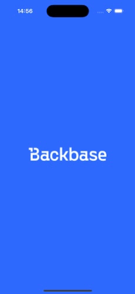

# Request App Store rating (iOS)
This repository contains implementation of requesting an App Store rating functionality for a Backbase iOS application

## Description
"Rating Request" implementation lets you request App Store rating from the users of a Backbase application. The implementation is flexible enough to be used in any place of the application as required and configurable on the frequency (at the moment it's number of months).



## Table of Contents

- [Requirements](#requirements)
- [Official Guidelines](#official-guidelines)

### Requirements
Mobile SDK 10.1.0 or higher is recommended due to Backbase Secure Storage usage.

### Official Guidelines
Please review official [Apple Guidelines](https://developer.apple.com/documentation/storekit/requesting-app-store-reviews) for requesting App Store Ratings from users.

## Test App
"RatingRequestApp" is a test app that includes one ViewController which has the code to trigger an App Store rating in ```viewDidAppear(_ animated:)``` method as an example.

## Invoke App Store review
```
        // Request app store review, with 3 months frequency.
        // this will not request another review request for 3 months

        let ratingRequestManager = RatingRequestManager.build(with: 3)
        ratingRequestManager.requestReviewIfAppropriate()
```

## License

Backbase License. See [LICENSE](LICENSE) for more info.
